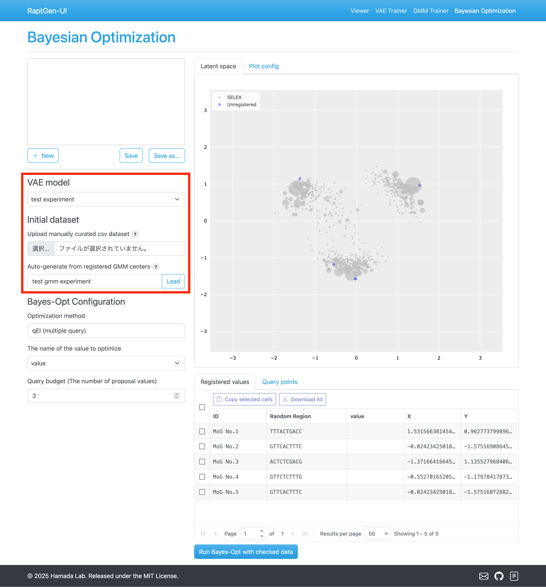
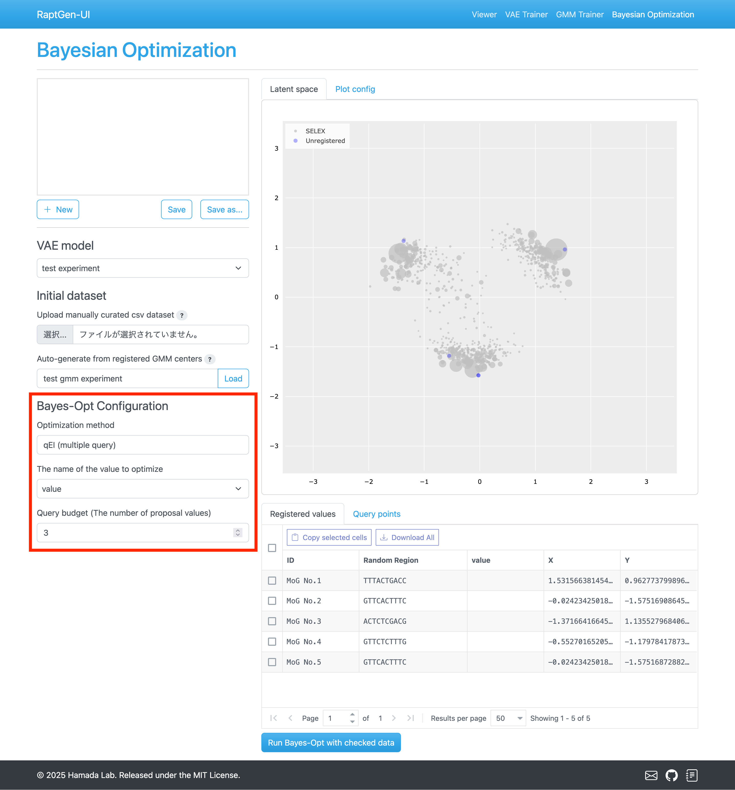
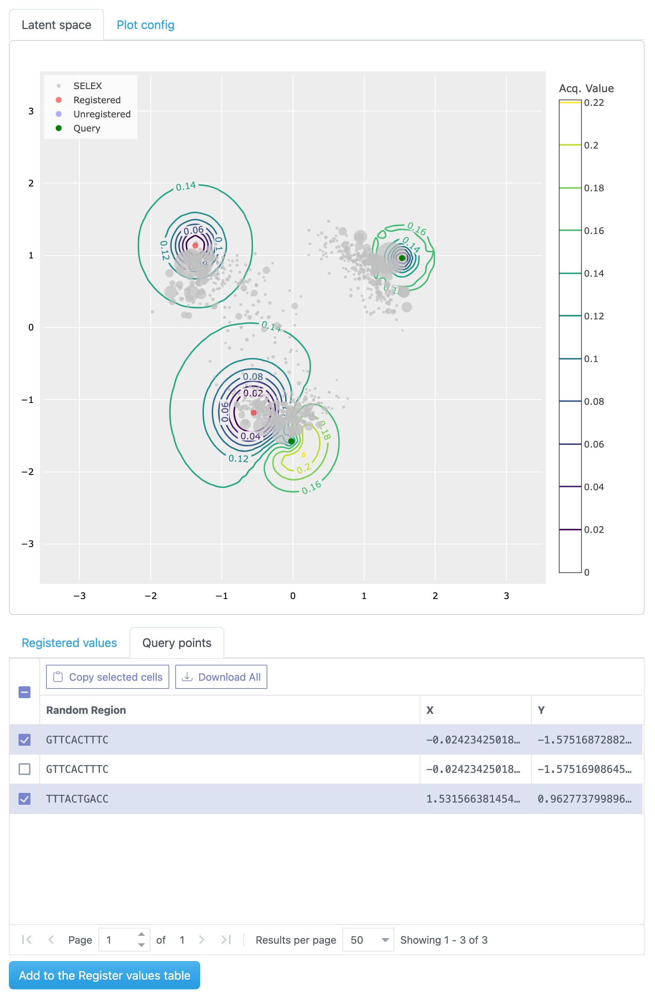

# Bayesian Optimization

Optimize the HT-SELEX data with Bayesian Optimization.

## Access to Bayesian Optimization Page

Click the `Bayesian Optimization` link in the top menu or the one in the navigation bar.

## How to Run Bayesian Optimization

Briefly, the Bayesian Optimization will be run in the following steps:

1. Load the initialization dataset.
2. Configure the optimization parameters.
3. Measure the target function. In this case, you will need to prepare the sequence affinity data using SPR (Surface Plasmon Resonance) or other methods.
4. Run the Bayesian Optimization and get new candidate sequences.
5. Back to step 3.

We will explain each step in detail in the following sections.

### Loading the initialization dataset

When you access the Bayesian Optimization page, the following view will be shown.
Please select the VAE model and the initialization dataset.
The centroid of the Gaussian Mixture Model (GMM) is selected for this explanation, but you can also use manually selected sequences.

Following is the explanation of the dropdowns and forms.

- upload csv dataset:
  - the csv dataset for the initial dataset. The csv dataset should have the following columns with header:
    - `random_regions`: The sequence of the DNA.
    - `seq_id`: The affinity of the sequence.
    - `target`: The target value of the sequence. This is the value to be optimized.
      - the column name is not fixed. You can set the target column name on the `Bayes-Opt Configuration` component.
- or get from registered GMM centers:
  - The GMM centers from the GMM model. You can select the GMM model from the list. The GMM models can be trained with the [GMM Trainer](GMM_Trainer.md).
  - If you select the GMM centers, set the target value of the sequences manually.

### Bayes-Opt Configuration

Please set the optimization parameters.
The optimization parameters determine the behavior of the Bayesian Optimization.
Following are the parameters to set.

- `Optimization method`:
  - The optimization method. You can choose `qEI` for multiple query Expected Improvement.
- `The name of the value to optimize`:
  - Select the column of the uploaded csv. This is the column name of the target value in the csv dataset. If you select the GMM centers for initial optimization, this column name do not affect the optimization.
- `Query budget`:
  - The number of queries for the optimization. The optimization will be stopped after the number of queries.

### Measuring the target function

After setting the optimization parameters, see the `Registered values` table.
You will see sequences and their corresponding latent coordinates in the table.

If you loaded the initial dataset from GMM centers, fill in the target value of each sequence in the `value` column.

After that, select the entry you want to put in the optimization job. Click the checkboxes on the left side of the table.

### Running the Optimization

After setting the optimization parameters, click the `Run Bayes-Opt with checked data` button. The optimization will be started and the result will be shown on the `Latent Space` component and `Query points by Bayesian Optimization` component.

In the `Latent Space` component, the sequences are colored by the target value. The contour shows the acquisition function of the Bayesian Optimization.

The candidate sequences and their corresponding latent coordinates will be listed on the `Query points` component.
To add the query points for next optimization, click the `Add to the registered values table` button.

## Saving the session

For parallel processing, we implemented the session saving feature.

You can save the bayesian optimization session by clicking the `Save` or `Save as...` button.
If you click the `Save as...` button or `Save` button for the first time, you will be asked to enter the name of the session.
Please enter the name and click the `Save` button.

If you want to load the session later, click the entry on the left top of the page.
