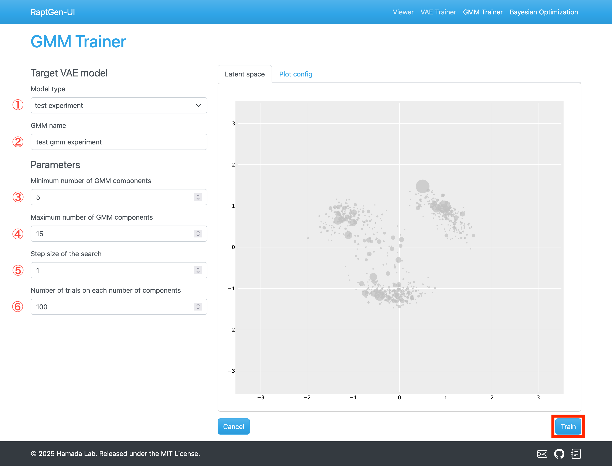

# GMM Trainer

In this page, you can train a GMM on the encoded HT-SELEX data.

## Access the GMM Trainer

Click the `GMM Trainer` link in the top menu or the one in the navigation bar.

## How to Train

### Adding a new training job

start by clicking the `+ Add a New Training Job` button.

### Setting the parameters

Set the preprocessing parameters for the training job. After setting the parameters, click the `Next` button.

**The parameters**

- ① Model Type:
  - The type of the trained model. You can choose the model trained in the VAE Trainer.
- ② GMM name:
  - the name of the GMM model.
- ③ Minumum number of GMM components:
  - The minimum number of GMM components.
- ④ Maximum number of GMM components:
  - The maximum number of GMM components.
- ⑤ Step size of the search:
  - The step size of the search for the number of GMM components.
- ⑥ Number of trials on each number of components:
  - The number of iterations for the GMM training.

The GMM training is runned multiple times to select the best BIC model among the models trained with the different number of GMM components. The number of the training is determined by the following formula:

$$
\text{Number of trials} = \text{Number of trials on each number of components} \times (\text{Maximum number of components} - \text{Minimum number of components} + 1)
$$

The higher the number of the trials is, the more accurate the GMM model will be. However, the training time will be longer.

### Training the GMM model

Once the training is submitted, the training will be started. The training progress will be shown on the `Running` component.

### Add the model to the Model List

After the training is finished, `Add to viewer dataset` button will be enabled.
Click the button to add the model to the dataset.
By default, the best number of components is selected based on the BIC score.
If you want to change the number of components, you can click the dropdown and select the desired one.

When you click the button, the following dialog will be shown.
Fill in the name of the model and click the `Add to Viewer Dataset` button.

### Next Steps

- [Bayesian Optimization](BO.md)
