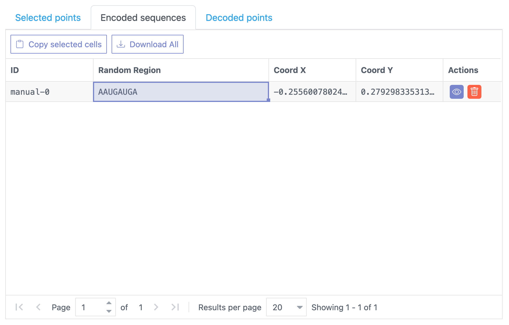

# Viewer

Interactive viewer for the trained model.

## Access to Viewer Page

Click the `Viewer` link in the top menu or the one in the navigation bar.

## Features

This page has the following features.

- Encode sequences to the latent space.
- Decode the points in latent space to the sequences.
- Download the sequences.
- Interactively select the points in latent space.

We will explain each feature in the following sections.

## Encoding sequences

Encoding sequences can be done by entering the sequence in the form or by uploading a file in `.fasta` format.
Each entry must be a sequence of `A`, `C`, `G`, `T`, or `U`. Ambiguous base `N` is not allowed.

When you fill in the form, click `+` button to encode and add the sequence to the table.
Encoding results are shown in the `Encoded seqeunces` table in the buttom of the latent plot.

In the encoded sequences table, you can modify, delete, and toggle to show the sequences. If you want to delete the sequence or toggle the visibility, click the trash icon or the eye icon, respectively. If you want to modify the sequence, double click the cell in the `Random Region` column.

## Decoding points in latent space

Decoding module has two panels. The top panel is to select x and y coordinates of the points in the latent space, and the bottom panel is to show the result of decoding.

In the top panel, there is a toggle button to switch visibility of the grid lines. This is useful when you want to know the coordinates of the points in the latent space.

In the bottom panel, you can see the decoded sequence and the `+` button in the right. Click it to add the sequence to the `Decoded points` table.

Coordinates in the `Decoded points` table can be modified by double clicking the cell. If you want to delete sequences or toggle the visibility, click the trash icon or the eye icon, respectively.

Weblogos at the specified coordinate is shown when you click `Weblogo` toggle button. This is calculated from the raw output parameters of the pHMM decoder.
x-axis is the position in the sequence, and y-axis is the log probability of the base at the position.

`Secondary structure` toggle button shows the secondary structure of the decoded sequence, which includes the 3' and 5' flanking constant regions.

## Downloading clusters

To download the sequences in the specified cluster, select the cluster from the dropdown menu and click the `Download` button.

You can download the sequences in `.fasta` format, when you toggled on the `Download as Fasta format` switch.

If you want to download the sequences with generative probability, toggle on the `Download as probabilities` switch. In this case, the sequences and the probabilities are downloaded in the `.csv` format.

## Interactively selecting points in latent space

This feature is implemented with the [plotly.js](https://plotly.com/javascript/) library.
First, click the `Box Select` or `Lasso Select` button to change the selection mode.

Then, click and drag the mouse to select the points in the latent space. Unselected points are shown in gray.

Selected points are shown in `Selected points` table. You can save the selected points as a file by clicking the `Download All` button.
